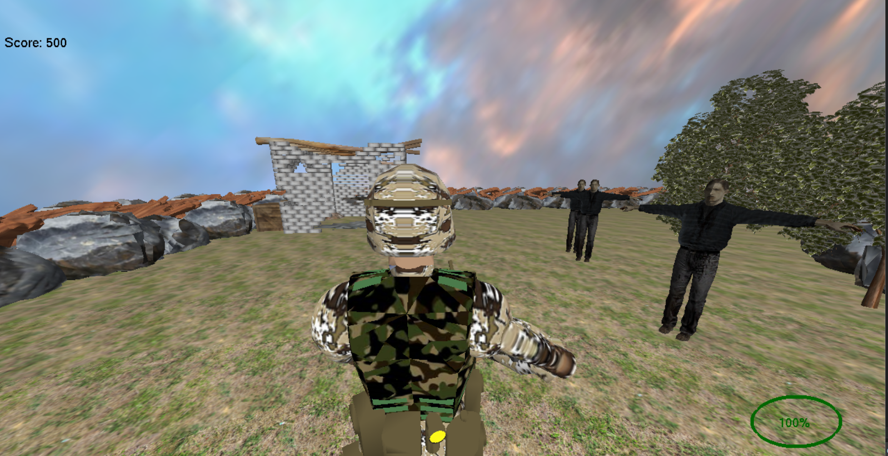
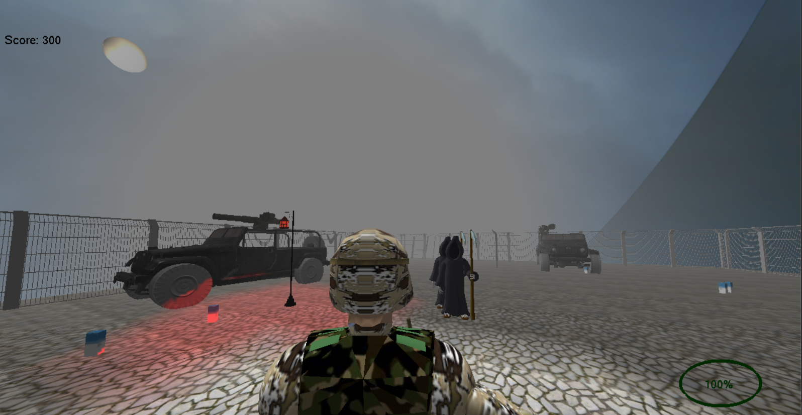

# Zombieland

A 3D zombie survival game consisting of two levels, where the player has to collect as many supplies as possible while evading the zombies and then return to the safe zone.
Made using OpenGL in C++.

## Demo

#### First Scene

#### Second Scene

## Controls
- `W`: Move forwards
- `A`: Move left
- `S`: Move backward
- `D`: Move right
  
- `mouse`: Look around with the camera
- `1`: First-person camera
- `2`: Third-person camera
- `3`: Top-view camera
- `space`: Jump
  
- `v`: Skip to the second scene (Testing only)

## Authors

- [@mahmoudaboueleneen](https://www.github.com/mahmoudaboueleneen)
- [@abdelrahmanAbouelkheir](https://github.com/abdelrahmanAbouelkheir)
- [@AbdelrahmanRewaished](https://github.com/AbdelrahmanRewaished)
- [@Ahmedsherif74](https://github.com/Ahmedsherif74)
